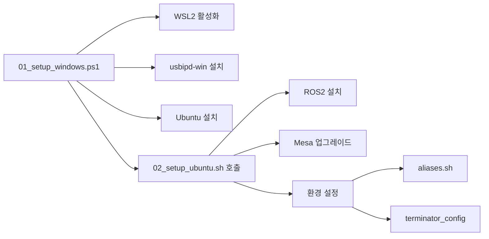

# ROS2 Hunter Lab 환경

Windows 11/10에서 **WSL2 네이티브로 ROS2 Humble 개발 환경**을 자동 구축하는 프로젝트입니다.

## 🚀 주요 기능

| 기능 | 설명 |
|------|------|
| **원클릭 설치** | PowerShell 스크립트 하나로 WSL 활성화부터 ROS2 설치까지 자동화 |
| **스마트 드라이브 감지** | D:\, E:\ 드라이브가 있으면 자동 선택 (C:\ 공간 절약) |
| **강력한 성능** | `ccache`(빌드 가속), `uv`(고속 Python 패키징), `Cyclone DDS` 기본 적용 |
| **스마트 드라이브** | D:\, E:\ 드라이브 자동 감지 및 설치 |
| **GPU 가속** | WSLg D3D12 / Intel / NVIDIA 자동 감지 및 설정 |
| **USB 장치 연동** | usbipd-win 자동 설치로 CAN, 센서 연결 지원 |
| **SSO 원칙** | 모든 설정을 `config/` 디렉토리에서 중앙 관리 |
| **Native Linux 지원** | WSL2 뿐만 아니라 Ubuntu 네이티브에서도 사용 가능 |

## 📋 필수 조건

- Windows 10/11 (Build 19041 이상)
- 관리자 권한 (Administrator)
- BIOS에서 가상화(VT-x/AMD-V) 활성화

## 🛠️ 설치 가이드

### 1단계: Windows 설정

**PowerShell을 관리자 권한**으로 실행:

```powershell
.\scripts\01_setup_windows.ps1

# 옵션: 드라이 런 (실행하지 않고 로그만 확인)
.\scripts\01_setup_windows.ps1 -DryRun
```

**수행 작업:**
1. WSL2 기능 활성화 (필요시 재부팅 안내)
2. WSL 커널 업데이트
3. **usbipd-win** 설치 (USB 장치 연동)
4. `.wslconfig` 복사 (메모리/네트워크 최적화)
5. Ubuntu 22.04 다운로드 및 설치
6. 프로젝트 복사 → `~/env`
7. Linux 부트스트랩 실행

### 2단계: Ubuntu 설정

```bash
# WSL 터미널에서 (Windows 스크립트가 자동 실행하지 않았을 경우)
cd ~/env
sudo bash scripts/02_setup_ubuntu.sh
```

**수행 작업:**
1. HWE 커널 설치 (Native Linux 전용)
2. 기본 패키지 설치
2. **ROS2 Humble** + Cyclone DDS + 유용한 도구(xacro, joint-state-publisher-gui)
3. **uv** (Fast Python Installer) 설치
4. **Mesa PPA** 최신 드라이버 업데이트
5. 사용자 및 환경 설정(bashrc, aliases, Terminator, ccache 설정)

### 3단계: 설치 확인

```bash
# 새 터미널 열기 또는
source ~/.bashrc

# ROS2 확인
ros2 --version

# ROS2 & DDS 확인
echo $RMW_IMPLEMENTATION  # rmw_cyclonedds_cpp

# GPU 상태 확인
hw_check
```

## 🔌 USB/CAN 장치 연결

```powershell
# Windows PowerShell (관리자)
usbipd list                              # 장치 목록 확인
usbipd bind --busid <BUSID>              # 장치 바인딩
usbipd attach --wsl --busid <BUSID>      # WSL에 연결
```

```bash
# WSL에서 확인
lsusb
ip link show can0  # CAN 장치
```

## 🖥️ GPU/하드웨어 관리

| 명령어 | 설명 |
|--------|------|
| `hw_check` | 종합 하드웨어 진단 (GPU, Vulkan, Display) |
| `gpu_check` | OpenGL 렌더러 빠른 확인 |
| `gpu_auto` | GPU 자동 설정 (D3D12/Intel/NVIDIA) |
| `use_cpu` | 소프트웨어 렌더링 강제 (문제 해결용) |
| `vulkan_check` | Vulkan 지원 확인 |

## ⚡ 빠른 시작 명령어

### ROS2 & 빌드
| 명령어 | 설명 |
|--------|------|
| `cb` | `colcon build --symlink-install` |
| `cbp <pkg>` | 특정 패키지만 빌드 |
| `s` | `source install/setup.bash` |
| `sb` | `source ~/.bashrc` |
| `rt` / `rn` | 토픽 / 노드 리스트 |
| `ccache-stat` | 컴파일러 캐시 통계 확인 |

### 네비게이션
| 명령어 | 설명 |
|--------|------|
| `cw` | `cd ~/ros_ws` |
| `cs` | `cd ~/ros_ws/src` |
| `ce` | `cd ~/env` |

### ROS2 명령어
| 명령어 | 설명 |
|--------|------|
| `rt` | `ros2 topic list` |
| `rn` | `ros2 node list` |
| `rr` | `ros2 run` |
| `rl` | `ros2 launch` |
| `gzs` | Gazebo 실행 |

### WSL2 전용
| 명령어 | 설명 |
|--------|------|
| `explorer` | Windows 탐색기 열기 |
| `c` | VS Code 열기 |
| `t` | Terminator 터미널 열기 |
| `c` | VS Code 열기 |
| `explorer` | 윈도우 탐색기 열기 |

## 📂 디렉토리 구조

```
.
├── config/                      # [SSO] 설정 중앙 관리
│   ├── .wslconfig               # WSL 전역 설정
│   ├── install_config.ps1       # Windows 의존성 (MSI URL 등)
│   ├── install_config.sh        # Linux 패키지 목록 (ROS2, DevTools)
│   ├── aliases.sh               # Bash aliases
│   └── terminator_config        # GUI 터미널 설정
├── scripts/
│   ├── 01_setup_windows.ps1     # Windows 설치 스크립트
│   ├── 02_setup_ubuntu.sh       # Ubuntu 설치 스크립트
│   ├── hardware_check.sh        # 하드웨어 진단
│   └── gpu_setup.sh             # GPU 설정
│   └── lib/                     # 모듈화된 함수들 (installers.sh 등)
└── README.md
```

## ⚙️ 설정 커스터마이징

### 패키지 추가/제거

`config/install_config.sh` 수정:

```bash
# ROS2 패키지 추가
ROS2_PACKAGES=(
    "ros-humble-desktop-full"
    "ros-humble-your-package"  # 추가
)

# 개발 도구 추가
DEV_PACKAGES=(
    "terminator"
    "tree"  # 추가
)
```

### Cyclone DDS (통신 미들웨어)
기본값은 `Cyclone DDS`입니다. 변경하려면 `~/.bashrc` 수정:
```bash
export RMW_IMPLEMENTATION=rmw_cyclonedds_cpp  # 기본값
# export RMW_IMPLEMENTATION=rmw_fastrtps_cpp
```

### WSL 메모리/CPU 설정

`config/.wslconfig` 수정:

```ini
[wsl2]
memory=8GB
processors=4
```

### 기본 사용자 변경

`config/install_config.ps1` 수정:

### Windows 의존성 추가
`config/install_config.ps1`에서 MSI 패키지 추가 가능:

```powershell
WindowsDependencies = @(
    @{ Name="App"; Url="https://..."; FileName="app.msi"; CheckCommand="app" }
)
```

## 🛑 트러블슈팅

| 문제 | 해결 방법 |
|------|----------|
| WSL 설치 실패 | BIOS에서 가상화(VT-x) 활성화 확인 |
| GPU 인식 안됨 | `gpu_auto` 실행, Windows GPU 드라이버 업데이트 |
| Gazebo 검은 화면 | `use_cpu` 실행 (소프트웨어 렌더링) |
| USB 장치 안 보임 | `usbipd attach --wsl --busid <BUSID>` 실행 |
| ROS2 명령어 없음 | `source ~/.bashrc` 실행 |
| 터미널 크래시 | `wsl --shutdown` 후 재시도 |

## 📝 아키텍처


